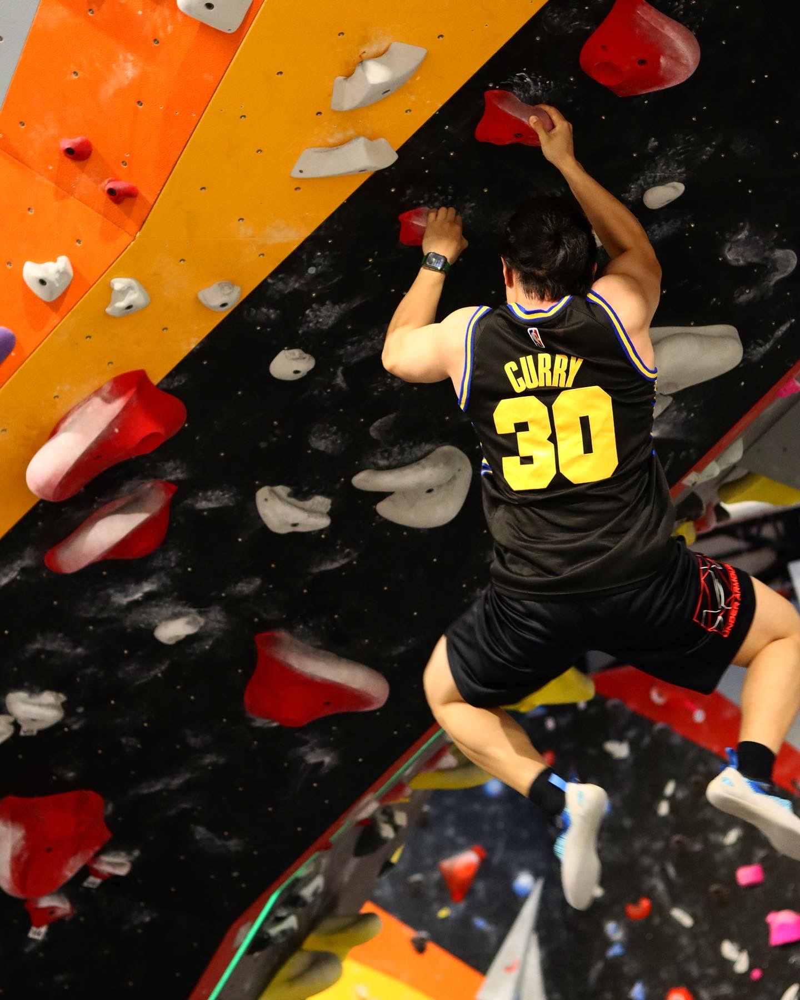
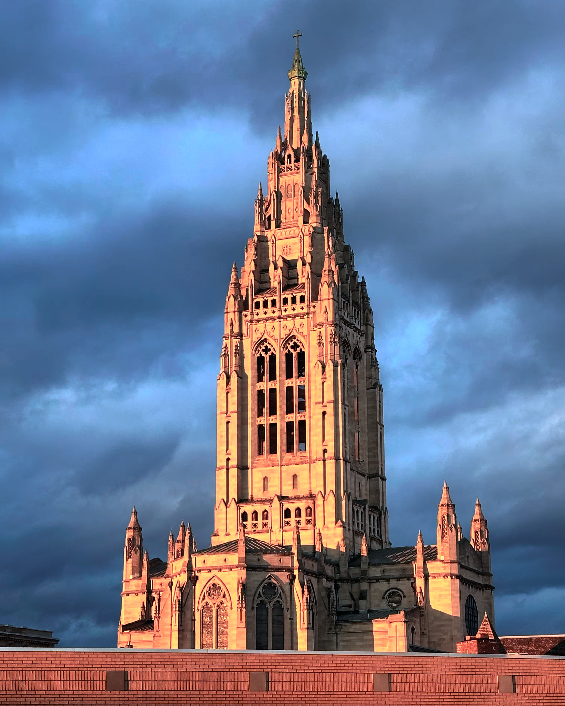
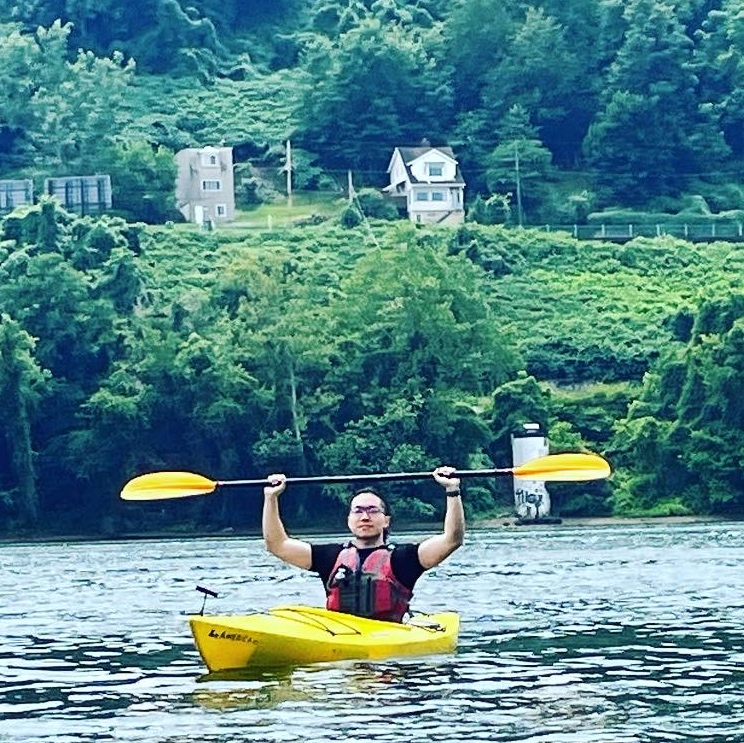
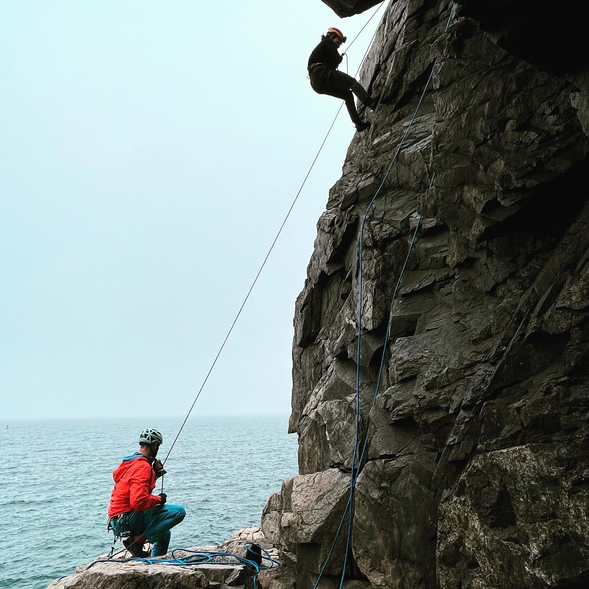

As a dedicated sports enthusiast, I've been into bodybuilding /powerlifting 💪🏋️‍♂️ for five years and have competed several times during my undergraduate studies.

Over the past year, I've also developed a passion for bouldering and rock climbing 🧗‍♂️, which I've been enjoying for six months. A particularly memorable experience was rock climbing at Acadia National Park, with cliffs overlooking the Atlantic Ocean, on a foggy day – it was an unforgettable moment in my life. Additionally, I take pleasure in cycling 🚴, especially when chasing sunrises and sunsets. 

Exercise has become a near-daily ritual for me, significantly contributing to my overall well-being and productivity.

I've also been cutting my own hair 💇‍♂️ for 2 years, a skill I find quite cool.

Below is a collection of photos I took during training, riding, and hiking.

    
    
    
    
    
    
    
    

